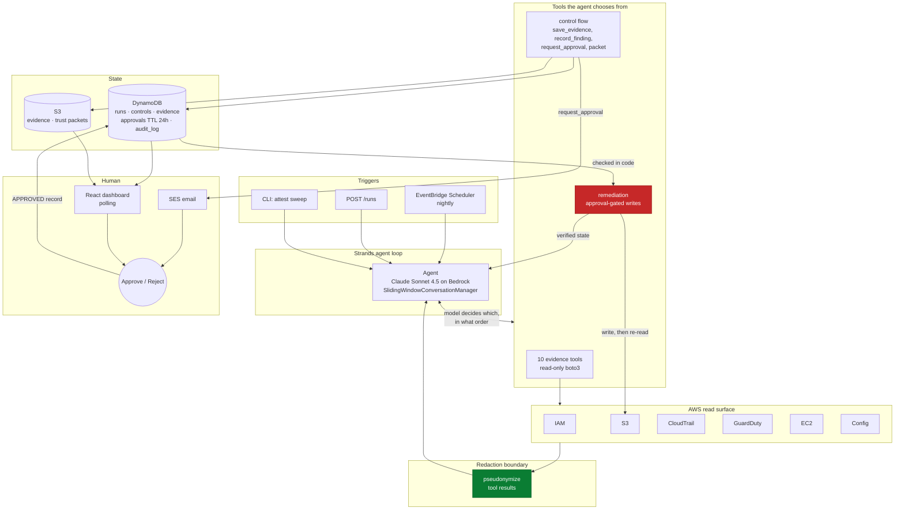
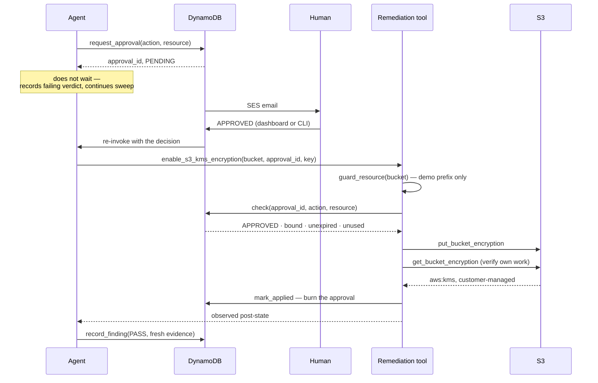

# Architecture

## The shape of it

One Strands agent, a set of tools, and two places where control leaves the model
and enters code: the approval gate and the redaction boundary.

## Why the agent is load-bearing

`controls/catalog.yaml` lists `candidate_tools` per control. It does not define
an order, and no Python anywhere iterates it to "run the sweep". The agent reads
the catalog, decides which tools to call, notices that one credential report
answers two controls, falls back to a different tool when one fails, and decides
when it has enough to judge each control.

The clearest evidence that this matters is partial observability. One seeded
bucket denies `s3:GetEncryptionConfiguration`. The tool returns
`encrypted: null` with an error code rather than raising, and the agent has to
decide that this specific bucket is unobservable — marking the control
`INDETERMINATE` rather than reporting `PASS` for a bucket it could not read, or
aborting the sweep. That judgment is not expressible as a fixed sequence.

## The two boundaries

### 1. Approval gate — control leaving the model

Both checks live in the tool body. A model asserting approval is not
authorization, and an approved request for a resource outside the demo prefix is
still refused. Approvals are bound to one `(action, resource)` pair, expire
after 24h, and are single-use.

### 2. Redaction boundary — identities leaving AWS

Pseudonymization is applied *inside* `@tool`, so the model never receives a real
IAM user name or email. Identities therefore cannot reach the conversation
transcript, the dashboard timeline, a screenshot, or a demo recording — not just
the stored evidence.

It is deterministic, so the same principal maps to the same pseudonym across
runs and drift comparison still works; structure-preserving, so counts and
cardinality survive; and reversible only through a local, gitignored map.

## Data model

| Table | Key | Holds |
|---|---|---|
| `attest_runs` | `run_id` | one sweep: status, trigger, summary |
| `attest_controls` | `run_id` + `control_id` | verdict, rationale, cited evidence ids |
| `attest_evidence` | `run_id` + `evidence_id` | pointer to raw JSON in S3, plus a copy |
| `attest_approvals` | `approval_id` | action, resource, status, `expires_at` (TTL) |
| `attest_audit_log` | `run_id` + `seq` | append-only record of every tool call |

Evidence is stored as a JSON string rather than a native DynamoDB map. That
sidesteps float/Decimal conversion entirely and keeps a byte-exact copy of what
the tool returned — which is what "cite the evidence" requires.

## Deployment

The agent is importable and runtime-agnostic: nothing in `agent/attest.py` knows
how it was invoked. The same container serves the local CLI, AgentCore Runtime,
or Lambda behind API Gateway. That choice is deferred to Phase 6 and is a
deployment decision only.

Two IAM roles, separated by intent:

- **`EvidenceRole`** — `ReadOnlyAccess` / `SecurityAudit`. Used for all sweeps.
- **`RemediationRole`** — only the specific write actions the remediation tools
  need, assumable only through the approval-checked code path.
